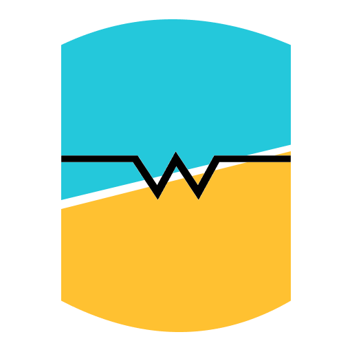

# Dreka
UX-focused ground control station

<h1 align="center">
  
  <br>
  Dreka GCS
  <br>
</h1>

<h3 align="center">
Ground control station based on <a href="https://github.com/tauri-apps/tauri">Tauri</a> and <a href="https://github.com/CesiumGS/cesium">Cesium</a>.
</h3>

## Building

### Web client only
Modern Node.js and [yarn](https://classic.yarnpkg.com/lang/en/docs/install/#mac-stable) are required:

```shell
cd clinet
yarn install
yarn tauri dev
```

### Server 
Install rust, [rustup](https://www.rust-lang.org/tools/install) is the preffered way
```shell
cd server
cargo run
```

### Desktop client with server embedded 
You should install tauri prerequisites, see [here](https://tauri.app/v1/guides/getting-started/prerequisites) for more details.

```shell
cd clinet
yarn install
yarn tauri dev
```
